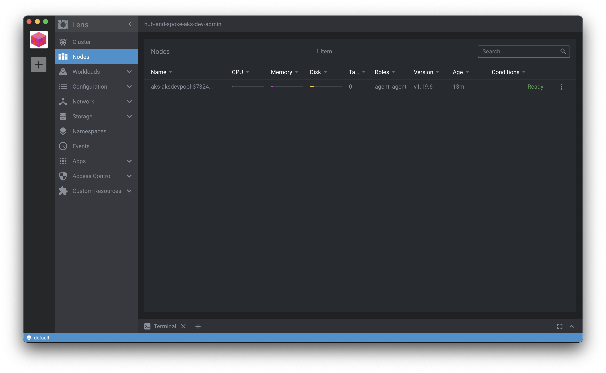

# AKS environment

## Requirement

You need to check few things before executing the stack.

### Current terraform worspace

Terraform will create or update the environment corresponding to the current worspace.

Discover the workspaces:

```bash
# Show workspace list
$ terraform workspace list
  default
* dev
  prod
  staging

# Show current workspace
$ terraform workspace show
dev
```

Select the workspace corresponding to the environment you want to work on:

```bash
$ terraform workspace select dev
Switched to workspace "dev".
```

The terraform state for each workspace is stored in a dedicated state file.
All these terraform state files are stored in the same backend.

### AKS SSH key pair

The stack need an SSH key pair to allow SSH connection to the AKS nodes.

- The key pair must exist and have been pushed into the Azure Key Vault before executing the stack.

#### Generate a new SSH key pair

Use the following script to generate an SSH key pair and push resulting file as secrets in the Key Vault:

```bash
$ cd ../../scripts
$ ./aks_key_pair.sh [dev|staging|prod]
```

### Check variables for the current environment

Check the variables for the current environment (workspace) in the file [`variables.tf`](variables.tf).

#### AKS public SSH key

The name of the secret in Key Vault that contains the public SSH key deployed in AKS nodes of each environment:

```hcl
variable "ssh_pub_key_secret_name" {
  type = map
  default = {
    "dev"       = "aks-dev-ssh-pub"
    "staging"   = "aks-test-ssh-pub"
    "prod"      = "aks-prod-ssh-pub"
  }
}
```

#### AKS node size

The size of Azure virtual machines provision in AKS node pool for each environment:

```hcl
variable "node_size" {
  type = map
  default = {
    "dev"       = "standard_ds3_v2" # 4vCPUs, 14GiB
    "staging"   = "standard_ds3_v2" # 4vCPUs, 14GiB
    "prod"      = "standard_ds3_v2" # 4vCPUs, 14GiB
  }
}
```

> Please note that [not all sizes are compatible with the ephemeral disks](https://docs.microsoft.com/en-us/azure/virtual-machines/ephemeral-os-disks) recommended by Microsoft for AKS environments.

#### AKS node count

The number of nodes in the AKS pool for each environment:

```hcl
variable "node_count" {
  type = map
  default = {
    "dev"       = 1
    "staging"   = 1
    "prod"      = 2
  }
}
```

#### Private load balancer IP

Private IP address used for Ingress load balancer:

```hcl
variable "aks_ingress_lb_ip" {
  type = map
  default = {
    "dev"       = "10.1.127.200"
    "staging"   = "10.2.127.200"
    "prod"      = "10.4.127.200"
  }
}
```

### Create workspaces

Create the different workspace we need:

```bash
$ terraform init
$ terraform workspace new prod
$ terraform workspace new staging
$ terraform workspace new dev
```

## Deploy

Deploy the stack:

```bash
$ terraform apply
```

If gou get an error like bellow, [adapt Service Principal permissions on API as described in this post](https://github.com/hashicorp/terraform-provider-azuread/issues/131).

```bash
* azuread_application.example: graphrbac.ApplicationsClient#Create: Failure responding to request: 
StatusCode=403 -- Original Error: autorest/azure: Service returned an error. Status=403 Code="Unknown" 
Message="Unknown service error" Details=[{"odata.error":{"code":"Authorization_RequestDenied",
"date":"2019-08-06T00:08:31","message":{"lang":"en","value":"Insufficient privileges to 
complete the operation."} ,"requestId":"78a334e1-27e6-4933-af8c-5809a08e384b"}}]
```

## Get AKS cluster credentials

Use the Azure CLI to get the cluster credentials:

```bash
$ az aks get-credentials -g hub-and-spoke-aks-dev -n hub-and-spoke-aks-dev -a --overwrite
```

Don't forget to adapt names with the current workspace name.

Then you can directly use kubectl:

```bash
$ kubectl get nodes
NAME                                 STATUS   ROLES   AGE   VERSION
aks-aksdevpool-37324794-vmss000000   Ready    agent   13m   v1.19.6
```

Or adding the cluster in [Lens](https://www.mirantis.com/software/lens/):



## Install ingress controller

The terraform stack that create the AKS cluster cannot also use kubernetes and/or helm providers because of instabilities, it is well explained in [this article](https://itnext.io/terraform-dont-use-kubernetes-provider-with-your-cluster-resource-d8ec5319d14a)

We can follow the [Azure documentation for installing nginx ingress controller](https://docs.microsoft.com/en-us/azure/aks/ingress-internal-ip#create-an-ingress-controller):

```bash
# Add the repo
$ helm repo add ingress-nginx https://kubernetes.github.io/ingress-nginx

# Use Helm to deploy an NGINX ingress controller
$ helm install nginx-ingress ingress-nginx/ingress-nginx \
    -f ingress/dev.yaml \
    --set controller.replicaCount=2
```

> Use the file corresponding to the current environment your are working on.

## Install demo app

Deploy the demo app:

```bash
$ kubectl create namespace demo
$ kubectl apply -f app/demo-dev.yaml
```

> Use the right file depending on the current environement

## Check connectivity

### Network connectivity

```bash
# Launch ubuntu pod
$ kubectl apply -f https://gist.githubusercontent.com/tcdowney/b8a0297241b74f94ef1fc6627f7ea69a/raw/eaae035f5adca37ca00d4a49f1c1958fe3db89e3/ubuntu-sleep.yaml

# Open a shell in the ubuntu pod
$ kubectl exec -it ubuntu -- /bin/bash

# Install tools
$ apt update && apt install curl iputils-ping wget -y

$ wget google.fr
Resolving google.fr (google.fr)... 172.217.169.67, 2a00:1450:4009:818::2003
Connecting to google.fr (google.fr)|172.217.169.67|:80... connected.
HTTP request sent, awaiting response... 301 Moved Permanently
Location: http://www.google.fr/ [following]
--2021-02-09 13:42:10--  http://www.google.fr/
Resolving www.google.fr (www.google.fr)... 216.58.210.195, 2a00:1450:4009:81a::2003
Connecting to www.google.fr (www.google.fr)|216.58.210.195|:80... connected.
HTTP request sent, awaiting response... 200 OK
Length: unspecified [text/html]
Saving to: 'index.html'

index.html                                             [ <=>                                                                                                            ]  13.43K  --.-KB/s    in 0.01s

2021-02-09 13:42:10 (981 KB/s) - 'index.html' saved [13752]

```

### Ingress

Test that you can access the demo app requesting the private load balancer:

```bash
# Open a shell in the ubuntu pod
$ kubectl exec -it ubuntu -- /bin/bash

# Request the app 
$ curl -H "Host: dev.linkbynet.com" 10.1.127.200
```

Check that you get the Nginx welcome page.

---
<!DOCTYPE html>
<html>
<head>
<title>Welcome to nginx!</title>
<style>
    body {
        width: 35em;
        margin: 0 auto;
        font-family: Tahoma, Verdana, Arial, sans-serif;
    }
</style>
</head>
<body>
<h1>Welcome to nginx!</h1>
<p>If you see this page, the nginx web server is successfully installed and
working. Further configuration is required.</p>

<p>For online documentation and support please refer to
<a href="http://nginx.org/">nginx.org</a>.<br/>
Commercial support is available at
<a href="http://nginx.com/">nginx.com</a>.</p>

<p><em>Thank you for using nginx.</em></p>
</body>
</html>
---
